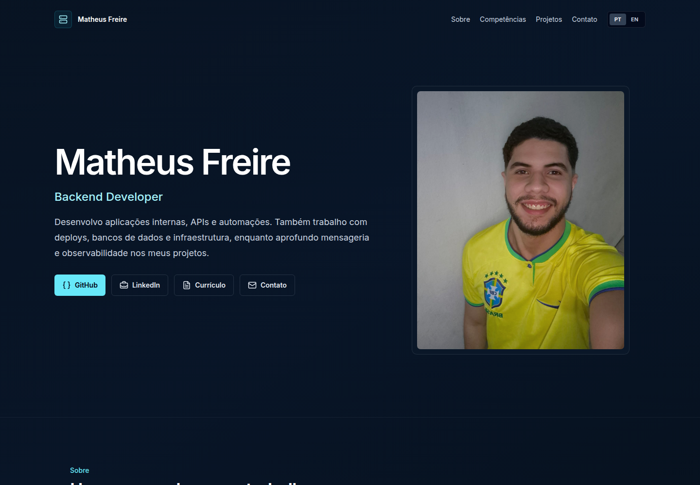

# Matheus Freire — Portfolio

Personal portfolio for Matheus Freire, a Backend Developer who works with internal applications, APIs, automations, deployments, and infrastructure.

**Published site:** [matheus-freire-portfolio.vercel.app](https://matheus-freire-portfolio.vercel.app/)



## Stack

- React 19 and TypeScript
- Vite
- Tailwind CSS
- Framer Motion
- Lucide React
- ESLint with TypeScript and React Hooks rules

## Local development

Requirements: Node.js 22 and npm.

```bash
npm ci
npm run dev
```

Vite prints the local development URL after startup.

## Quality checks and build

```bash
npm run lint
npm run typecheck
npm run build
```

The production bundle is generated in `dist/`. GitHub Actions runs the same checks with a reproducible `npm ci` installation.

## Structure

```text
public/                  Static assets, résumé, and project imagery
src/components/layout/  Navigation, footer, and shared section headings
src/components/projects Project presentation components
src/components/sections Portfolio sections
src/data/                Profile, skills, and project metadata
src/types/               Shared TypeScript types
src/i18n.ts              PT-BR and English content
src/styles.css           Tailwind layers and visual tokens
```

## Internationalization

The interface supports Brazilian Portuguese and English. Translation content is defined in `src/i18n.ts`; the selected language is stored in `localStorage` and applied to the document `lang` attribute.

The available résumé is currently PT-BR only, so both interface languages link to the same clearly identified file.

## Deployment

The site is currently published on Vercel. The repository does not include platform-specific deployment configuration; any static host capable of serving the Vite `dist/` output can host the build.
